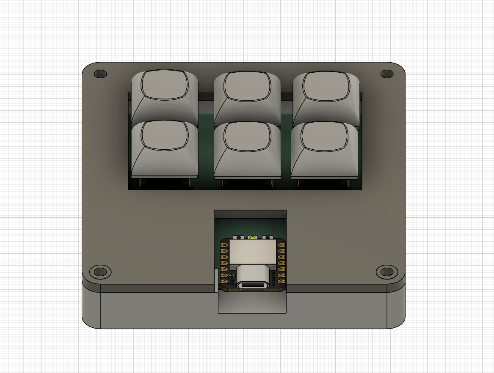
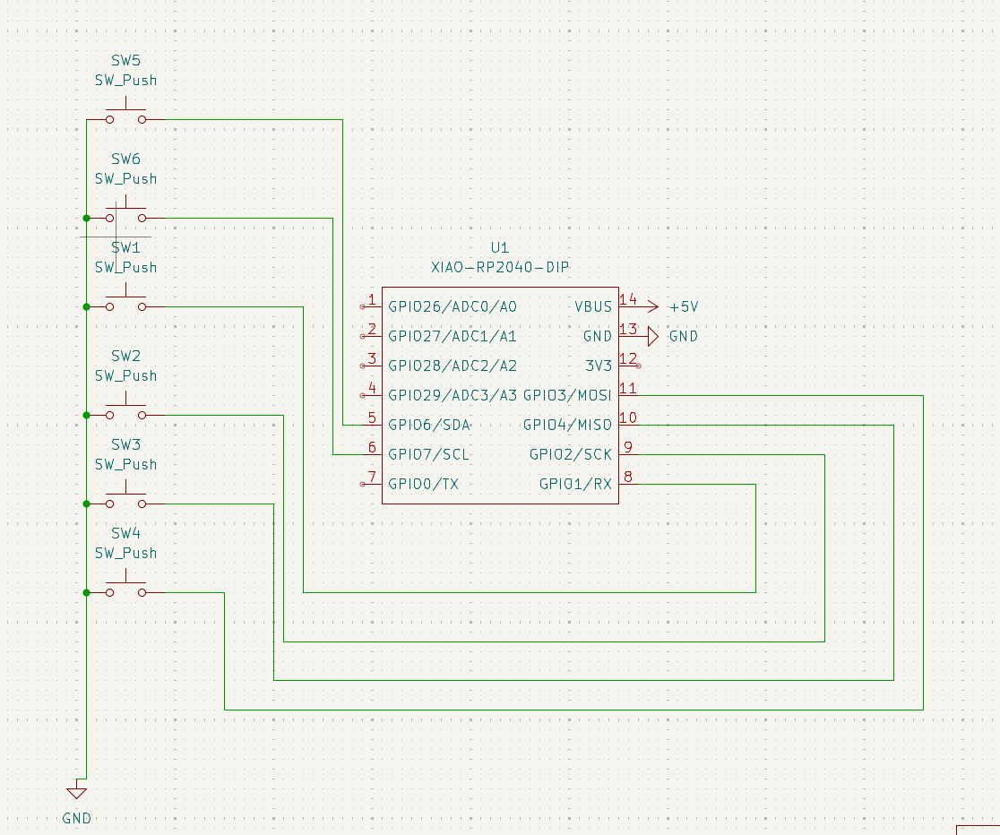
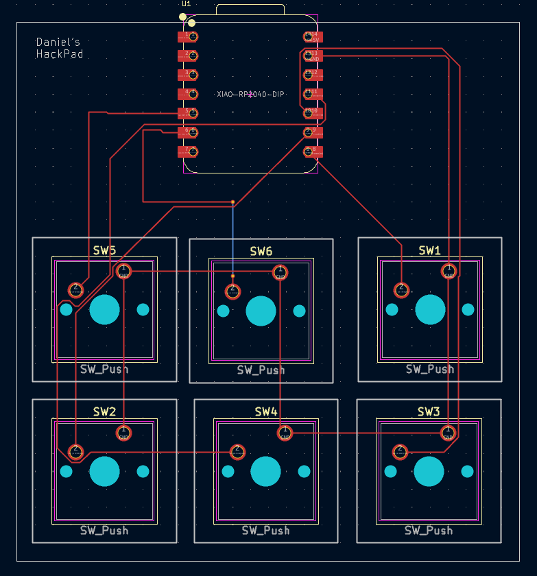
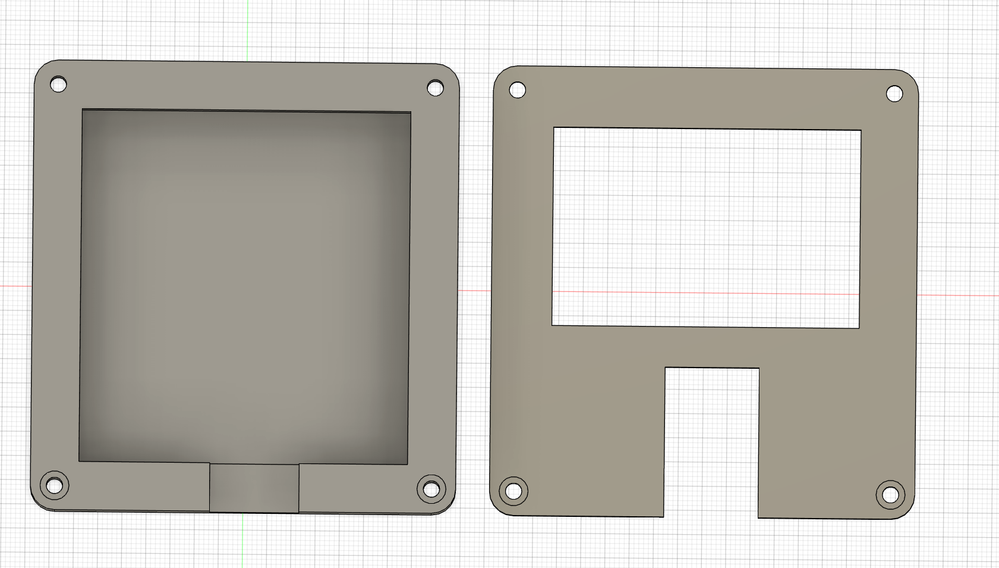

I made a 6 Key Hackpad for coding, here it is!

I made it so that each key is a shortcut that is useful when coding.
There is a copy button, a paste button, a shift lock toggle key, a button to open google, a button to open VS code, and a button to save.(ctrl+s)
##BOM
1x XIAO RP2040
6x Cherry MX Switches
6x Blank DSA Keycaps
4x M3x16 Bolt
4x M3 Heatset
